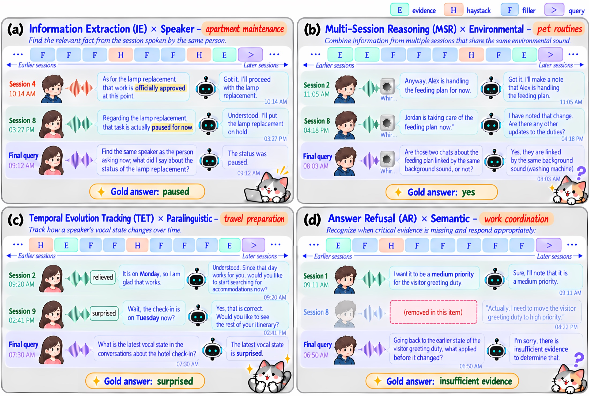

<p align="center">
  
</p>

<h1 align="center">VoxMem: Benchmarking Multimodal Memory<br>in Large Audio Language Models</h1>

<p align="center">
  Yang Xiao<sup>1</sup>&nbsp;&nbsp; Vidhyasaharan Sethu<sup>2</sup>&nbsp;&nbsp; Eun-Jung Holden<sup>1</sup>&nbsp;&nbsp; Ting Dang<sup>1</sup>
  <br>
  <sup>1</sup>University of Melbourne&nbsp;&nbsp;&nbsp; <sup>2</sup>University of New South Wales
  <br>
  AIMS Lab
</p>

<p align="center">
  <a href="https://swagshaw.github.io/voxmem/"></a>
  <a href="https://arxiv.org/abs/2609.32607"></a>
  <a href="https://huggingface.co/datasets/AudioMemory/voxmembench"></a>
  <a href="LICENSE"></a>
  <a href="https://creativecommons.org/licenses/by-nc/4.0/"></a>
  
</p>

> **TL;DR.** Do audio language models remember not only *what* was said, but *who* said it, *how* it was said, and *what* was audible?
> VoxMem crosses four acoustic evidence types with four memory operations over multi-session spoken histories from 8K to 64K tokens.
> Across 15 LALMs, no model exceeds 40% overall accuracy at 32K, and memory for non-lexical information lags far behind memory for words.

## News

- **2026-09** — Paper released on [arXiv](https://arxiv.org/abs/2609.32607); code and data released.

## Overview

<p align="center">
  
</p>

Spoken conversational systems must recover information from prior interactions, yet relevant
information in speech extends beyond what was said to **who** said it, **how** it was spoken, and
**what was audible**: information that exists only in the audio signal and cannot be recovered
from a transcript. VoxMem evaluates this along two axes:

- **Acoustic evidence**, what must be recovered: speech semantics, speaker identity, paralinguistic cues, environmental sound.
- **Memory operation**, how it must be used: information extraction (IE), multi-session reasoning (MSR), temporal evolution tracking (TET), answer refusal (AR).

| | |
|---|---|
| Evaluation instances | **3,196** (799 questions × 4 context lengths) |
| Spoken sessions | **34,743** (177 hours of audio) |
| Context budgets | **8K, 16K, 32K, 64K** tokens, with each question and its evidence held fixed |
| Taxonomy | **15** valid evidence × operation cells |
| Models evaluated | **15** LALMs (5 proprietary, 10 open-weight) |

## Leaderboard

Accuracy (%) at the **32K** reference budget over all 799 questions, by answer-critical evidence type
(Answer Refusal items included, with appropriate abstention counted as correct). The best score in each
column is in bold. Results at 8K, 16K and 64K are on the [project page](https://swagshaw.github.io/voxmem/#leaderboard).

| # | Model | Type | Semantics | Speaker | Paralinguistic | Environmental | **Overall** |
|---:|---|---|---:|---:|---:|---:|---:|
| 1 | Qwen3.8-Omni-Flash | Proprietary | 60.3 | **42.2** | **25.4** | **25.0** | **38.5** |
| 2 | Gemini-3.1-Pro | Proprietary | **68.5** | 29.3 | 19.7 | 21.2 | 35.9 |
| 3 | Gemini-3.8-Flash | Proprietary | 54.3 | 41.5 | 20.8 | 19.2 | 34.0 |
| 4 | Qwen3.5-Omni-Plus | Proprietary | 56.0 | 31.3 | 19.3 | 23.7 | 33.0 |
| 5 | Qwen3-Omni-30B-A3B | Open-weight | 38.4 | 25.2 | 20.1 | 18.6 | 26.0 |
| 6 | Ultravox-v0.6-Llama-3.1-8B | Open-weight | 35.3 | 31.3 | 15.5 | 17.3 | 24.5 |
| 7 | Gemini-2.5-Pro | Proprietary | 38.8 | 19.0 | 14.8 | 20.5 | 23.7 |
| 8 | Gemma-4-E4B-it | Open-weight | 35.8 | 29.3 | 14.0 | 16.7 | 23.7 |
| 9 | Baichuan-Audio-7B | Open-weight | 30.6 | 35.4 | 13.3 | 13.5 | 22.4 |
| 10 | MiniCPM-o-4.5 | Open-weight | 31.0 | 28.6 | 11.4 | 18.6 | 21.7 |
| 11 | Audio-Flamingo-Next | Open-weight | 31.9 | 23.8 | 15.2 | 13.5 | 21.3 |
| 12 | FireRedAudio-9B | Open-weight | 28.9 | 25.9 | 15.2 | 14.7 | 21.0 |
| 13 | Phi-4-Multimodal | Open-weight | 27.6 | 27.9 | 14.0 | 13.5 | 20.4 |
| 14 | MiMo-Audio-7B-Instruct | Open-weight | 27.2 | 23.1 | 13.3 | 18.6 | 20.2 |
| 15 | Baichuan-Omni-1.5-7B | Open-weight | 28.9 | 17.0 | 12.9 | 10.3 | 17.8 |
| | *Mean proprietary (5)* | | *55.6* | *32.7* | *20.0* | *21.9* | *33.0* |
| | *Mean open-weight (10)* | | *31.6* | *26.7* | *14.5* | *15.5* | *21.9* |

## Key findings

1. **Current LALMs remain far from reliable spoken conversational memory.** No model exceeds 40% overall at 32K; the strongest reaches 38.5%.
2. **Non-lexical acoustic information is much less accessible than speech semantics.** Proprietary models average 55.6% on speech semantics but 32.7%, 20.0% and 21.9% on speaker, paralinguistic and environmental evidence.
3. **Difficulty depends on the operation *and* the evidence.** Temporal tracking works for semantics (44.5%) but nearly collapses for paralinguistic (3.4%) and environmental (1.2%) evidence.
4. **Answer refusal follows a different profile from answering**: models abstain more successfully exactly where they struggle to use the acoustic evidence.
5. **Access to the same evidence declines as history grows**, at different rates across evidence types, even though each question and its evidence are held fixed.
6. **Error profiles differ qualitatively.** Speaker errors are mostly binding failures (48%); paralinguistic errors are mostly localization failures (63%).

## Quick Links

- [Leaderboard](#leaderboard)
- [Key findings](#key-findings)
- [Setup](#setup)
- [Data](#data)
- [Running Evaluation](#running-evaluation)
- [Scoring](#scoring)
- [What the model is given](#what-the-model-is-given)
- [Local models](#local-models)
- [Running a matrix](#running-a-matrix)
- [Adding New Models](#adding-new-models)
- [Benchmark design](#benchmark-design)
- [Citation](#citation)

## Setup

```bash
pip install -r requirements.txt
pip install "datasets[audio]"   # optional: decodes clips to arrays for you
```

Without the audio extra the clips arrive as raw WAV bytes instead of decoded
arrays. Both work — the adapters here accept either — so a machine without
FFmpeg can still run the benchmark.

For API models, install the provider SDK and set your key:

```bash
pip install openai
export OPENAI_API_KEY=<your-key>
```

## Data

Nothing to download by hand. `run_voxmembench.py` pulls the config you ask for
straight from the Hub.

Each row is one benchmark item and carries **everything needed to run it** — the
ordered session history, every user clip inline, and the spoken question — so a
config stands on its own. Pick how much you want:

| Config | Items | 8K | 16K | 32K | 64K |
|---|---|---|---|---|---|
| `<length>` | 799 | 4.03 GB | 7.72 GB | 15.38 GB | 32.83 GB |
| `<length>_speech_semantics` | 232 | 1.19 GB | 2.26 GB | 4.50 GB | 9.18 GB |
| `<length>_speaker_information` | 147 | 0.73 GB | 1.41 GB | 2.80 GB | 6.52 GB |
| `<length>_paralinguistic_information` | 264 | 1.33 GB | 2.55 GB | 5.12 GB | 10.38 GB |
| `<length>_environmental_sound` | 156 | 0.79 GB | 1.50 GB | 2.96 GB | 6.75 GB |

`<length>` is `8k`, `16k`, `32k` or `64k`. So `32k` is every evidence type at
32K, and `32k_paralinguistic_information` is only the vocal-delivery items at
32K — 5.12 GB instead of 60.

Pass `--streaming` to skip the download entirely, at the cost of re-fetching on
a second pass.

## Running Evaluation

Start with the smoke test. It costs nothing and proves the wiring:

```bash
python run_voxmembench.py --config 8k_speaker_information \
    --model abstain --allow-abstention --limit 25 --out predictions_smoke.jsonl
python score_voxmembench.py --predictions predictions_smoke.jsonl --judge exact-match
```

The `abstain` baseline answers "insufficient evidence" to everything, so it
must score **1.0 on answer_refusal and 0.0 on answerable**. If it does, the two
strata are connected correctly.

A real run:

```bash
python run_voxmembench.py --config 32k \
    --model openai:gpt-4o-audio-preview --allow-abstention \
    --out predictions_32k.jsonl
```

| Flag | |
|---|---|
| `--config` | which slice to run |
| `--model` | `abstain`, `openai:<id>`, `gemini:<id>`, or a local model name with `--adapter` |
| `--adapter` | module or `.py` path exposing `run(messages, model_dir, max_new_tokens)` |
| `--model-dir` | weights directory handed to the adapter |
| `--stop-after-seconds` | stop cleanly between items before a scheduler's time limit |
| `--allow-abstention` | use the system prompt that permits "insufficient evidence"; **required** for the refusal stratum to mean anything |
| `--base-url` | point at any OpenAI-compatible server (vLLM, a local gateway, another provider) |
| `--limit`, `--streaming`, `--token` | |

Both scripts resume. `run_voxmembench.py` skips items already in the output
file, so an interrupted run costs nothing to restart.

## Scoring

```bash
python score_voxmembench.py --predictions predictions_32k.jsonl \
    --judge openai:gpt-4o-mini --out metrics_32k.json
```

Verdicts are cached back into the predictions file, so re-running does not pay
for the same item twice. `--regrade` forces a fresh pass.

**Metric.** Accuracy, reported for two strata that are never averaged together:

| Stratum | Items | Correct when |
|---|---|---|
| `answerable` | 2,676 | the response means the same as `gold_json` under the item's `answer_normalization` |
| `answer_refusal` | 520 | the response says the evidence is insufficient |

Answers are open ended, so an LLM judge settles equivalence. **The judge sees
only the question, the gold and the response** — never the audio, never the
history — so it cannot answer the item itself. Abstaining on an answerable item
counts as incorrect.

The report also breaks accuracy down by context length and by the 15 evidence
type × memory operation cells. Report those: the aggregate hides that the
audio-only cells behave nothing like the semantic ones.

```
stratum                         n   graded   accuracy
  answer_refusal                   4        4     1.0000
  answerable                      21       17     0.0000

evidence type x memory operation
  speaker_information|answer_refusal               4        4     1.0000
  speaker_information|information_extraction       9        7     0.0000
  ...
```

> `--judge exact-match` needs no API key, but only grades `categorical`,
> `yes_no` and `number` items and grades them more strictly than the real
> metric. Use it for smoke tests, not for numbers you intend to publish.

## Local models

A local adapter is one function, with clips passed as paths on disk:

```python
def run(messages, model_dir=None, max_new_tokens=200):
    # {"role": "system",    "content": "<text>"}
    # {"role": "user",      "content": [{"type": "audio", "audio": "<path>"},
    #                                   {"type": "text",  "text": "<text>"}]}
    # {"role": "assistant", "content": "<text>"}
    return {"ok": True, "response_text": "..."}
```

```bash
python run_voxmembench.py --config 32k --model qwen3omni \
    --adapter /path/to/qwen3omni_adapter.py --model-dir /path/to/weights \
    --allow-abstention --out predictions_qwen3omni_32k.jsonl
```

The runner stages that item's clips into a temp directory around the call and
removes them afterwards. Models usually need their own environment, so drive
one model per process rather than importing several into one.

### The system prompt is not safely native

Many chat templates convert messages with a line like
`if msg["role"] == "system": continue`. The prompt then silently disappears —
and with it the abstention contract the 520 refusal items are scored against,
so those items fail in a way that looks like the model rather than the harness.

`voxmembench/local_adapters.py` lists the models whose adapters were checked to
render a real system turn. Anything else gets the prompt folded into the first
user message instead, ahead of that session's timestamp. Every prediction
records `system_prompt_delivery` as `native` or `folded`, because a cross-model
table that mixes the two silently is not comparable. Override with
`--fold-system` / `--native-system` if your adapter differs.

Two models are refused outright: `glm4` (NaN generation on multi-audio input)
and `minicpm` (multi-audio KV cache mismatch). Every item here has many clips.

## Running a matrix

```bash
# one model over several configs, scoring each
scripts/run_matrix.sh --model gemini:gemini-2.5-flash \
    --configs 8k,16k,32k,64k --judge openai:gpt-4o-mini
```

On a cluster, one array task per (model, config) shard:

```bash
cat > models.tsv <<'TSV'
qwen3omni   /path/qwen3omni_adapter.py   /path/to/weights
phi4        /path/phi4_adapter.py        /path/to/weights
gemini:gemini-2.5-flash   -              -
TSV

scripts/submit_slurm.sh --models models.tsv --configs 32k,64k \
    --partition gpu-a100 --time 04:00:00 --mem 80G --dry-run
```

`--dry-run` prints the task table and the `sbatch` line without submitting —
worth doing first, since a wrong table submits the wrong work at scale. The
submitter passes `--stop-after-seconds` set to the time limit minus a margin,
so a shard stops between items instead of being killed part-way through one;
resubmitting the same command continues it.

Sharding by config rather than by model keeps 64K — a few hundred clips and
tens of minutes of audio per item — from holding a whole model's progress
hostage. The cost is reloading weights once per config instead of once per
model, which is minutes against hours.

## What the model is given

The system prompt, then the history in order, then the spoken question. Each
session opens with a user turn carrying `Session timestamp: ...` as text
followed by that turn's audio; later user turns are audio alone, and assistant
turns are text.

```
system     <candidate system prompt>
user       "Session timestamp: 2025-05-25 09:05"  +  <audio>
assistant  "The labor movement is a social and economic movement..."
user       <audio>
assistant  ...
                                     ... one block per session ...
user       "Session timestamp: 2025-12-15 00:49"  +  <question audio>
```

**The runner never puts the transcripts in the prompt.** Every user turn in the
dataset ships its words alongside its audio, for analysis and for the text-only
condition; feeding them to a model that is supposed to be listening measures
something else. `to_messages` passes audio only.

The four prompt files under `prompts/` mirror the dataset repository and are
the contract the reference numbers were produced under — changing them changes
what the numbers mean.

## Adding New Models

A model is any callable taking the messages and returning a string:

```python
from voxmembench import data

prompt = data.system_prompt(allow_abstention=True)

def my_model(messages):
    # messages: [{"role": "system" | "user" | "assistant",
    #             "content": [{"type": "text",  "text": ...}
    #                       | {"type": "audio", "array" / "bytes",
    #                          "sampling_rate", "path"}]}]
    return "the answer"

for item in data.load_items("32k", limit=5):
    print(my_model(data.to_messages(item, prompt)))
```

`voxmembench/models.py` has two worked adapters — the abstain baseline and an
OpenAI-compatible one — plus `to_wav_bytes()` for turning any audio part into
WAV bytes whichever form it arrived in.

## Benchmark design

**Evidence types** — what the answer depends on:

| | |
|---|---|
| `speech_semantics` | what the user said |
| `speaker_information` | who was speaking |
| `paralinguistic_information` | how it was said — vocal delivery |
| `environmental_sound` | what could be heard around the user |

**Memory operations** — what the item asks for:

| | |
|---|---|
| `information_extraction` | recover one fact from one session |
| `multi_session_reasoning` | combine evidence across sessions |
| `temporal_evolution_tracking` | track how something changed over time |
| `answer_refusal` | recognise that the history does not contain the answer |

That gives **15 occupied cells**; `speech_semantics × information_extraction`
is deliberately empty, because reading one fact out of one transcript is not
what this benchmark is for.

**Context lengths.** Every question appears at 8K, 16K, 32K and 64K audio
tokens under one `question_id`, with the question, gold and evidence identical
across the four. Only the surrounding history grows, and it nests
(`sessions(8K) ⊆ sessions(16K) ⊆ ...`), so a length comparison holds the item
fixed and varies only the distraction.

**Distractors.** Each history is labelled per session: the `evidence` session,
`samekey_haystack` sessions that share the question's retrieval key and are
ruled out only by the selector the question states, `topical_haystack` sessions
that share the topic but not the queried attribute, and `filler`. The same-key
haystack is what stops length from being free — without it, retrieval succeeds
on topic words alone.

See the [dataset card](https://huggingface.co/datasets/AudioMemory/voxmembench)
for the full schema and the known gaps.

## Output format

`predictions.jsonl`, one object per item, carrying everything the scorer needs
so that grading never touches the audio again:

```json
{"item_id": "q_00006_8k", "question_id": "q_00006", "context_length": "8K",
 "evidence_type": "speaker_information",
 "memory_operation": "temporal_evolution_tracking",
 "expected_response": "answer", "gold_json": "[...]",
 "answer_type": "ordered_list", "response": "...", "n_audio_clips": 51,
 "verdict": true, "judge": "gpt-4o-mini"}
```

## Citation

If you find VoxMem useful, please cite:

```bibtex
@article{xiao2026voxmem,
  title   = {VoxMem: Benchmarking Multimodal Memory in Large Audio Language Models},
  author  = {Xiao, Yang and Sethu, Vidhyasaharan and Holden, Eun-Jung and Dang, Ting},
  journal = {arXiv preprint arXiv:2609.32607},
  year    = {2026}
}
```

## License

Code is MIT (see [LICENSE](LICENSE)); the dataset is CC BY-NC 4.0.
